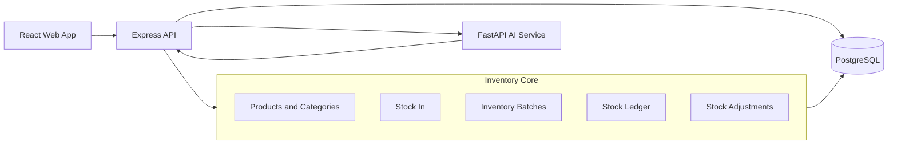
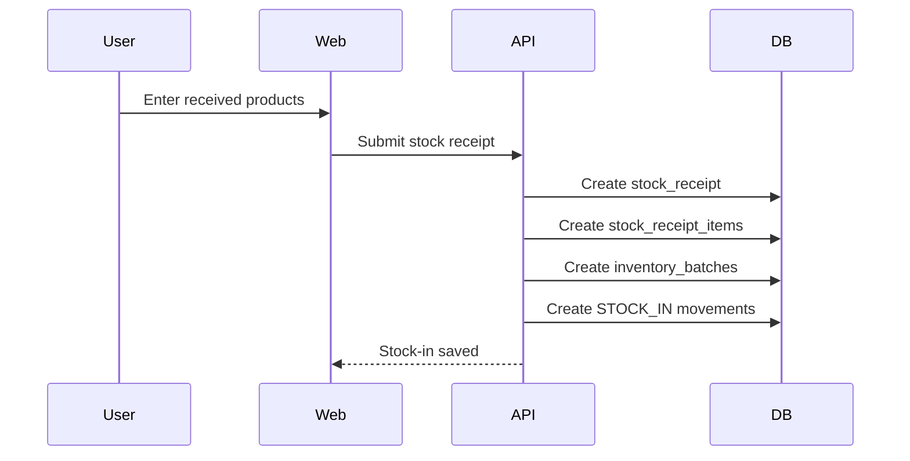
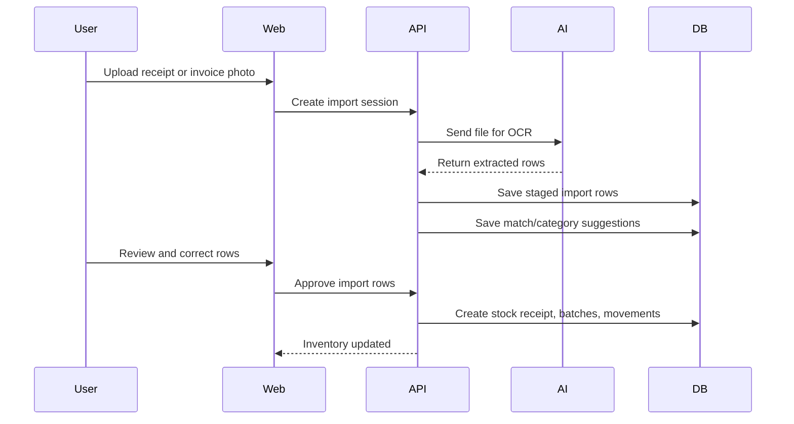

# Smart Inventory Management Architecture

## Current Product Scope

The first product should be a Smart Inventory Management system for a real community botika. It should not start as a full POS, accounting, or analytics platform.

The system should focus on:

1. Product catalog management
2. Category management
3. Manual stock-in
4. Stock batches, buying price, selling price, expiry, and lot tracking
5. Stock-on-hand monitoring
6. Low-stock and expiry alerts
7. Stock adjustments
8. Excel/CSV import staging
9. OCR-assisted inventory intake
10. Product matching and category suggestions

POS, accounting, and sales analytics can be added later without changing the inventory foundation.

## Recommended Monorepo Shape

```text
botika-management-system/
  apps/
    web/
    api/
    ai-service/
  packages/
    database/
    shared/
  docs/
```

For the current phase, only these parts need active development:

```text
apps/
  web/          React inventory UI
  api/          Express inventory API
  ai-service/   FastAPI OCR/product intelligence service
packages/
  database/     Prisma schema, migrations, seed data
  shared/       shared TypeScript types and constants
docs/
```

## Architecture Boundary



## Backend Modules

### Auth Module

Keep authentication minimal but real.

Initial features:

| Feature | Reason |
| --- | --- |
| Login | Protect inventory records. |
| Users | Track who received or adjusted stock. |
| Roles | Separate owner/admin from encoder/staff later. |

Do not overbuild permissions in the first pass. A simple role enum is enough unless the app already needs granular access control.

### Catalog Module

Owns product master data.

Responsibilities:

| Feature | Notes |
| --- | --- |
| Categories | Must support medicines and non-medicine goods. |
| Products | Product name, SKU, barcode, generic name, brand, unit, reorder level. |
| Aliases | Used for OCR, supplier names, W&O import names, and abbreviations. |
| Smart classification | AI suggests category, user confirms. |

Important rule: product records describe what the item is. They should not be treated as stock records.

### Inventory Module

Owns all stock quantities and cost layers.

Responsibilities:

| Feature | Notes |
| --- | --- |
| Stock In | Header for stock-in events. |
| Receipt items | Individual products received. |
| Inventory batches | Quantity, remaining quantity, buying price, selling price, expiry, lot number. |
| Stock Ledger | Append-only stock history. |
| Stock adjustments | Corrections, damaged goods, expired goods, physical count changes. |

Important rule: buying price belongs to a stock batch, not to the product.

### Import Module

Owns staged inventory intake before records become real stock.

Input methods:

| Method | First Version Behavior |
| --- | --- |
| Manual | User enters stock receipt directly. |
| Excel/CSV | Upload creates staged rows for review. |
| OCR | AI extracts staged rows from image/PDF. |

All approved rows should create the same inventory records as manual entry.

### AI Integration Module

The AI service should stay independent from the main API.

Responsibilities:

| Feature | Service |
| --- | --- |
| OCR extraction | Python FastAPI service |
| Product matching | Python service or API-side matching in early version |
| Category suggestion | Python service with ML/NLP model later |

The AI service should never directly write final inventory records. It can return suggestions and extracted rows only.

## Data Flow: Manual Stock-In



## Data Flow: OCR Stock-In



## Smart Inventory Features

### Product Matching

Goal: avoid duplicate products caused by OCR or supplier naming differences.

Example:

| Existing Product | OCR Text |
| --- | --- |
| AMOXICILLIN 500MG CAPSULE 100'S | AMOXICILLIN 500MG CAPS 100S |

Initial implementation can use:

1. Normalized text comparison
2. Product aliases
3. Fuzzy matching
4. Barcode match when available

Later implementation can add embeddings or ML-based matching.

### Category Suggestion

Goal: suggest product category from product name.

Examples:

| Product | Suggested Category |
| --- | --- |
| Amoxicillin | Antibiotic |
| Cetirizine | Antihistamine |
| Paracetamol | Pain/Fever |
| Diapers | Baby Care |
| Ice Cream | Frozen Goods |

The suggestion should always be reviewable and overrideable.

### Low-Stock Monitoring

Use:

```text
sum(inventory_batches.remaining_quantity) <= products.reorder_level
```

Only count batches with available remaining quantity.

### Expiry Monitoring

Use inventory batches, not products.

Useful alert windows:

| Alert | Condition |
| --- | --- |
| Expired | expiration_date < today |
| Near expiry | expiration_date <= today + 30/60/90 days |
| No expiry recorded | medicine-like products missing expiration date |

## API Structure

Recommended Express structure:

```text
apps/api/src/
  modules/
    auth/
      auth.routes.ts
      auth.service.ts
    catalog/
      catalog.routes.ts
      products.service.ts
      categories.service.ts
    inventory/
      inventory.routes.ts
      stock-receipts.service.ts
      stock-adjustments.service.ts
      stock-levels.service.ts
    imports/
      imports.routes.ts
      imports.service.ts
      ocr.service.ts
    alerts/
      alerts.routes.ts
      alerts.service.ts
  lib/
    prisma.ts
    errors.ts
    validation.ts
  server.ts
```

## Frontend Structure

Recommended React structure:

```text
apps/web/src/
  app/
    router.tsx
  features/
    catalog/
    inventory/
    imports/
    alerts/
    auth/
  components/
    ui/
    layout/
  lib/
    api.ts
    format.ts
```

## First Screens To Build

1. Product list
2. Product create/edit
3. Category management
4. Manual stock-in
5. Stock-on-hand dashboard
6. Low-stock list
7. Expiring-soon list
8. Stock adjustment form
9. Import sessions list
10. OCR/Excel review screen

## Database Scope For This Phase

Use only the inventory-first schema:

| Include Now | Defer |
| --- | --- |
| users | customers |
| categories | sales |
| products | sale items |
| product aliases | payments |
| product barcodes | expenses |
| suppliers | accounting reports |
| stock in | full analytics warehouse |
| stock in items | POS receipts |
| inventory batches | FIFO sale consumption |
| stock ledger | detailed permission matrix |
| stock adjustments |  |
| import sessions |  |
| import rows |  |
| match candidates |  |
| classification suggestions |  |

## Suggested Build Order

1. Initialize pnpm workspace structure.
2. Create `packages/database` with Prisma and PostgreSQL connection.
3. Implement focused inventory schema.
4. Seed default categories and one admin user.
5. Build API health check and Prisma connection.
6. Build category and product CRUD.
7. Build manual stock-in.
8. Build stock-on-hand, low-stock, and expiry queries.
9. Build stock adjustments.
10. Add import session and review workflow.
11. Add OCR endpoint in AI service.
12. Add product matching and category suggestion.

## What Not To Build Yet

Do not build these during the architecture-first inventory phase:

1. POS checkout
2. Receipt printing
3. Customer management
4. Expense accounting
5. Net profit dashboard
6. Sales forecasting
7. Full permission management
8. Complex supplier relationship management

These are valid future modules, but they will slow down the first useful version.
