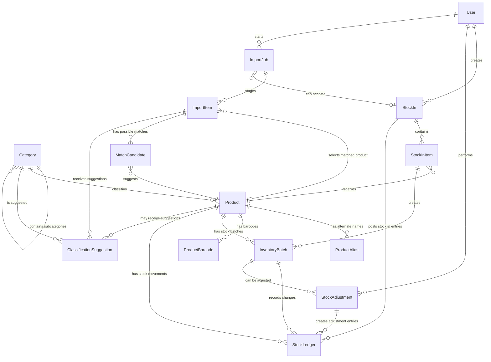

# Smart Inventory Domain Model

## Domain Philosophy

The database should model business concepts, not frontend pages or backend modules.

A page such as "Stock On Hand" may show product names, categories, quantities, expiration dates, and alerts, but that does not mean those fields belong to one database entity. Each business concept should own only the information that naturally belongs to it.

Important boundaries:

1. Products are not inventory.
2. Inventory is not purchasing.
3. Purchasing is not accounting.

Product records describe what an item is. Inventory records describe what quantity exists, where it came from, how much it cost, when it expires, and how it changes over time. Purchasing records describe a receiving event. Accounting records, when added later, should summarize or derive financial meaning from inventory and sales records.

The project follows DDD-lite. This means the model should use clear business language and strong ownership boundaries without adding heavy DDD patterns such as repositories, domain services, domain events, value objects, factories, CQRS, or event sourcing.

The goal is practical: create a domain model that is understandable to software engineers, accurate for a real community pharmacy, and ready to become a Prisma schema in the next phase.

## Aggregate Roots

Aggregate roots are the main business entities that other supporting entities gather around. They define the natural boundary for creating, updating, and validating related data.

| Aggregate Root | Why It Is An Aggregate Root |
| --- | --- |
| Product | Product is the central identity for items sold or stocked by the botika. Aliases, barcodes, category suggestions, stock records, and import matches all point back to it. |
| Category | Category organizes products and supports future reporting, search, classification, and analytics. It can exist independently of any single product. |
| Stock In | Stock In represents one receiving event. It groups all items received from manual entry, Excel/CSV import, OCR import, W&O migration, or informal supplier purchase. |
| Inventory Batch | Inventory Batch is the core stock layer. It owns received quantity, remaining quantity, buying price, selling price at receiving, expiration, and lot number. |
| Import Job | Import Job represents one attempted inventory intake from OCR, Excel, CSV, or migration. It owns staged rows and AI suggestions before anything becomes real inventory. |

Supporting entities exist around these roots:

| Supporting Entity | Root It Supports |
| --- | --- |
| Product Alias | Product |
| Product Barcode | Product |
| Stock In Item | Stock In |
| Stock Ledger | Product and Inventory Batch |
| Stock Adjustment | Inventory Batch |
| Import Item | Import Job |
| Match Candidate | Import Job and Product |
| Classification Suggestion | Import Job, Product, and Category |

## Business Entities

### User

Purpose

User represents a person who can access the system and perform inventory actions.

Responsibilities

| Responsibility | Notes |
| --- | --- |
| Identify staff actions | Track who created stock-in records, adjustments, and import jobs. |
| Support basic access control | Separate owner/admin work from staff/encoder work. |
| Support auditability | Help answer who changed inventory and when. |

Owns

1. Login identity
2. Display name
3. Role or access level
4. Active/inactive status

Does Not Own

1. Product data
2. Inventory quantities
3. Stock history
4. AI results

Relationships

| Relationship | Meaning |
| --- | --- |
| User creates Stock In | The user received or encoded inventory. |
| User creates Stock Adjustment | The user corrected or adjusted stock. |
| User creates Import Job | The user uploaded or started an import. |

Future Compatibility

User can later support POS cashier activity, accounting records, audit logs, and more detailed permissions.

### Category

Purpose

Category groups products into meaningful business classifications.

Responsibilities

| Responsibility | Notes |
| --- | --- |
| Organize products | Support browsing, filtering, and reporting. |
| Support mixed inventory | Medicines and non-medicine products must both fit. |
| Support AI classification | AI can suggest a category, but the user confirms it. |

Owns

1. Category name
2. Description
3. Parent category, when using subcategories
4. Active/inactive status

Does Not Own

1. Product stock quantity
2. Buying price
3. Expiration dates
4. Supplier information

Relationships

| Relationship | Meaning |
| --- | --- |
| Category has many Products | Products can be grouped for inventory and reporting. |
| Category can have child Categories | Allows Antibiotic under Prescription Medicine, or Baby Care under general merchandise. |
| Category receives Classification Suggestions | AI can recommend it for a product or import item. |

Future Compatibility

Category supports future POS filtering, analytics grouping, inventory recommendations, and financial reports by product type.

### Product

Purpose

Product represents the item identity used by the botika.

Responsibilities

| Responsibility | Notes |
| --- | --- |
| Define item identity | Name, SKU, unit, brand, generic name, and medicine metadata. |
| Support search and matching | Aliases and barcodes make products easier to find. |
| Support inventory monitoring | Reorder level belongs here because it describes how much stock the store wants to keep. |

Owns

1. Product identity
2. Product name
3. SKU
4. Generic name
5. Brand name
6. Dosage form
7. Strength
8. Unit
9. Default selling price
10. Reorder level
11. Prescription requirement flag
12. Product status

Does Not Own

1. Current stock
2. Buying price
3. Expiration date
4. Lot number
5. Purchase history
6. Stock movement history

Relationships

| Relationship | Meaning |
| --- | --- |
| Product belongs to Category | The product has one main classification. |
| Product has Product Aliases | Alternate names help prevent duplicates. |
| Product has Product Barcodes | Barcode lookup can identify the product. |
| Product has Inventory Batches | Stock exists as one or more batches. |
| Product appears in Stock Ledger | Quantity changes are recorded over time. |

Future Compatibility

Product will be reused by POS, reports, analytics, product recommendations, classification models, and W&O migration.

### Product Alias

Purpose

Product Alias stores alternate names for the same product.

Responsibilities

| Responsibility | Notes |
| --- | --- |
| Support OCR cleanup | OCR text often differs from the official product name. |
| Support supplier names | Suppliers may write names differently. |
| Support migration | W&O product names can be preserved as aliases. |
| Reduce duplicates | Matching aliases helps avoid creating repeated products. |

Owns

1. Alias text
2. Alias source

Does Not Own

1. Product identity
2. Category
3. Stock quantity
4. Price history

Relationships

| Relationship | Meaning |
| --- | --- |
| Product Alias belongs to Product | An alias cannot exist without the product it describes. |

Future Compatibility

Aliases can later improve search ranking, OCR matching, AI matching, and migration accuracy.

### Product Barcode

Purpose

Product Barcode stores barcode values connected to a product.

Responsibilities

| Responsibility | Notes |
| --- | --- |
| Identify products quickly | Barcode scanning should resolve to a product. |
| Support multiple packaging codes | One product may have more than one barcode over time. |

Owns

1. Barcode value
2. The product it identifies

Does Not Own

1. Selling price
2. Quantity
3. Expiration
4. Batch identity

Relationships

| Relationship | Meaning |
| --- | --- |
| Product Barcode belongs to Product | The barcode identifies one product record. |

Future Compatibility

Barcodes will be important for future POS, stock counts, product lookup, and supplier imports.

### Stock In

Purpose

Stock In represents one receiving event.

Responsibilities

| Responsibility | Notes |
| --- | --- |
| Group received items | One receiving event can contain many products. |
| Record source | Manual entry, Excel, CSV, OCR, W&O migration, or informal purchase. |
| Record optional supplier context | Supplier information is useful but cannot be required. |
| Become inventory after posting | Approved items create inventory batches and stock ledger entries. |

Owns

1. Source type
2. Optional supplier name or supplier reference
3. Optional invoice number
4. Date received
5. Notes
6. Status
7. User who received or encoded it

Does Not Own

1. Product metadata
2. Current stock across the whole store
3. Accounting profit
4. AI extraction results

Relationships

| Relationship | Meaning |
| --- | --- |
| Stock In has many Stock In Items | Each item represents one received product line. |
| Stock In may come from Import Job | Approved imports become normal stock-in records. |
| Stock In is created by User | Staff accountability is preserved. |

Future Compatibility

Stock In can later feed accounting, supplier purchase reports, W&O migration history, and cost tracking.

### Stock In Item

Purpose

Stock In Item represents one product line inside a Stock In event.

Responsibilities

| Responsibility | Notes |
| --- | --- |
| Record received product line | Product, quantity, buying price, selling price, expiration, and lot number. |
| Create inventory batch | Posting a stock-in item creates a batch. |
| Preserve received details | The original receiving details should remain available for review. |

Owns

1. Product reference
2. Quantity received
3. Buying price
4. Selling price at receiving
5. Expiration date
6. Lot number
7. Notes

Does Not Own

1. Product name as master data
2. Category
3. Remaining stock after future changes
4. Stock adjustment reasons

Relationships

| Relationship | Meaning |
| --- | --- |
| Stock In Item belongs to Stock In | It cannot exist without the receiving event. |
| Stock In Item references Product | It identifies what was received. |
| Stock In Item creates Inventory Batch | The received quantity becomes tracked stock. |

Future Compatibility

Stock In Item supports future purchase reports, supplier price history, and cost comparisons.

### Inventory Batch

Purpose

Inventory Batch represents a quantity of product received at a specific cost, selling price, expiration date, and lot number.

Responsibilities

| Responsibility | Notes |
| --- | --- |
| Track stock layer | Each batch is a cost and quantity layer. |
| Track remaining quantity | Stock-on-hand comes from remaining batch quantities. |
| Track expiry and lot | Required for pharmacy inventory safety. |
| Support future COGS | POS can later consume batches for FIFO costing. |

Owns

1. Initial quantity
2. Remaining quantity
3. Buying price
4. Selling price at receiving
5. Expiration date
6. Lot number
7. Date received
8. Batch status

Does Not Own

1. Product metadata
2. Category
3. Supplier master information
4. Import review state

Relationships

| Relationship | Meaning |
| --- | --- |
| Inventory Batch belongs to Product | Stock must always be tied to a product. |
| Inventory Batch is usually created from Stock In Item | Most stock enters through receiving. |
| Inventory Batch has Stock Ledger entries | Quantity changes are recorded as ledger entries. |
| Inventory Batch can be adjusted by Stock Adjustment | Corrections modify remaining stock and create ledger entries. |

Future Compatibility

Inventory Batch is the foundation for POS inventory deduction, FIFO COGS, expiry alerts, inventory valuation, and profit reporting.

### Stock Ledger

Purpose

Stock Ledger records every stock quantity change.

Responsibilities

| Responsibility | Notes |
| --- | --- |
| Preserve stock history | It should be append-only. |
| Explain quantity changes | Every increase or decrease should have a reason. |
| Connect stock changes to source records | Stock In and Stock Adjustment should create ledger entries. |

Owns

1. Product reference
2. Optional inventory batch reference
3. Movement type
4. Quantity change
5. Unit cost when relevant
6. Reference to the source business action
7. Date and time of movement
8. Notes

Does Not Own

1. Product metadata
2. Batch expiration as master data
3. User login data
4. Import extraction data

Relationships

| Relationship | Meaning |
| --- | --- |
| Stock Ledger references Product | Every movement affects a product. |
| Stock Ledger may reference Inventory Batch | Batch-level movement supports expiry and costing. |
| Stock Ledger is created by Stock In or Stock Adjustment | Business actions produce movement records. |

Future Compatibility

Stock Ledger supports audit trails, inventory reports, future POS deductions, returns, spoilage tracking, and analytics.

### Stock Adjustment

Purpose

Stock Adjustment represents a manual correction or non-sale inventory change.

Responsibilities

| Responsibility | Notes |
| --- | --- |
| Correct stock levels | Physical count differences, missing items, or encoding mistakes. |
| Remove unusable stock | Expired, damaged, spoiled, or returned to supplier. |
| Preserve reason | Every adjustment should explain why it happened. |
| Create ledger entries | Adjustments must be reflected in Stock Ledger. |

Owns

1. Adjustment reason
2. Notes
3. User who adjusted stock
4. Adjustment date
5. Adjustment line details

Does Not Own

1. Product master data
2. Original receiving event
3. OCR results
4. Accounting expense classification

Relationships

| Relationship | Meaning |
| --- | --- |
| Stock Adjustment is created by User | Accountability is preserved. |
| Stock Adjustment affects Product | The adjusted item is known. |
| Stock Adjustment may affect Inventory Batch | Batch-level adjustment supports expiry and cost accuracy. |
| Stock Adjustment creates Stock Ledger entries | The quantity change becomes part of stock history. |

Future Compatibility

Stock Adjustment can later support inventory audits, loss reports, expiry reports, and accounting write-offs.

### Import Job

Purpose

Import Job represents one attempted inventory intake from Excel, CSV, OCR, or migration.

Responsibilities

| Responsibility | Notes |
| --- | --- |
| Group staged import data | One upload or OCR task can produce many rows. |
| Track review status | Imports must be reviewed before affecting inventory. |
| Preserve source context | File, source type, notes, and processing state. |
| Prepare Stock In | Approved import items become normal Stock In records. |

Owns

1. Source type
2. Import status
3. Uploaded file references
4. Notes
5. User who started it
6. Created and updated timestamps

Does Not Own

1. Final inventory quantity
2. Product master truth
3. Confirmed buying price after stock-in posting
4. Accounting records

Relationships

| Relationship | Meaning |
| --- | --- |
| Import Job has many Import Items | Each extracted or spreadsheet row is staged for review. |
| Import Job is created by User | The upload or import has an owner. |
| Import Job can become Stock In | Approved items are converted into normal receiving records. |

Future Compatibility

Import Job supports OCR, Excel/CSV import, W&O migration, AI quality review, and future supplier document automation.

### Import Item

Purpose

Import Item represents one staged row extracted from OCR, Excel, CSV, or migration.

Responsibilities

| Responsibility | Notes |
| --- | --- |
| Store raw extracted product information | Product names may be messy or incomplete. |
| Support user review | The user confirms product, quantity, price, expiration, and lot number. |
| Hold selected product | A reviewed item points to the product it should update. |
| Prepare receiving line | Approved item can become a Stock In Item. |

Owns

1. Raw product name
2. Row number or extracted order
3. Suggested or selected product
4. Quantity
5. Buying price
6. Selling price
7. Expiration date
8. Lot number
9. Review status
10. Raw extracted data

Does Not Own

1. Final stock quantity
2. Product master metadata
3. Category truth
4. Stock ledger history

Relationships

| Relationship | Meaning |
| --- | --- |
| Import Item belongs to Import Job | It is one row in the import workflow. |
| Import Item may select Product | Review connects messy input to product truth. |
| Import Item has Match Candidates | Product matching suggestions help user review. |
| Import Item has Classification Suggestions | AI may suggest a category. |

Future Compatibility

Import Item can support better OCR confidence scoring, model feedback, supplier-specific templates, and migration review.

### Match Candidate

Purpose

Match Candidate represents a possible product match for an Import Item.

Responsibilities

| Responsibility | Notes |
| --- | --- |
| Suggest existing products | Prevent duplicate products from OCR or supplier naming differences. |
| Rank options | Store score or confidence so the UI can show best matches first. |
| Explain matching method | Track whether the match came from alias, barcode, fuzzy text, or future ML. |

Owns

1. Import item reference
2. Candidate product reference
3. Match score
4. Matching method

Does Not Own

1. Final product decision
2. Product metadata
3. Inventory quantity
4. Category assignment

Relationships

| Relationship | Meaning |
| --- | --- |
| Match Candidate belongs to Import Item | It exists to help review a specific staged row. |
| Match Candidate references Product | It suggests one existing product. |

Future Compatibility

Match Candidate can support fuzzy matching, barcode matching, aliases, embeddings, and model evaluation.

### Classification Suggestion

Purpose

Classification Suggestion represents an AI recommendation for product category.

Responsibilities

| Responsibility | Notes |
| --- | --- |
| Suggest category | Help classify new or messy products. |
| Store confidence | Let the user judge suggestion quality. |
| Preserve model context | Track which model made the suggestion. |
| Remain reviewable | The user always makes the final decision. |

Owns

1. Suggested category
2. Confidence score
3. Model name
4. Model version
5. Product or import item being classified

Does Not Own

1. Final category assignment
2. Product identity
3. Inventory quantity
4. Stock movement history

Relationships

| Relationship | Meaning |
| --- | --- |
| Classification Suggestion may belong to Product | Existing products can receive suggestions. |
| Classification Suggestion may belong to Import Item | New imported rows can receive suggestions before product creation. |
| Classification Suggestion references Category | It recommends a category. |

Future Compatibility

Classification Suggestion supports ML/NLP product classification, model comparison, feedback loops, and analytics.

## Entity Boundaries

### Product

Owns:

1. Product identity
2. Product metadata
3. Generic name
4. Brand
5. Barcode through Product Barcode
6. Category
7. Reorder level

Does Not Own:

1. Current stock
2. Buying price
3. Expiration
4. Lot number
5. Purchase history

Why:

The same product can be received many times at different costs, expiration dates, and lot numbers. If buying price or expiration were stored directly on Product, the system would lose the history needed for real inventory control. Product should answer "what is this item?" Inventory Batch should answer "what stock do we currently have?"

### Inventory Batch

Owns:

1. Initial quantity
2. Remaining quantity
3. Buying price
4. Selling price at receiving
5. Expiration
6. Lot number

Does Not Own:

1. Product metadata
2. Category
3. Supplier master information

Why:

Inventory Batch is the stock layer. It should know the cost, quantity, and expiry of that specific received stock. It should reference Product for identity and Category through Product. Supplier context belongs to Stock In because it describes the receiving event, not the stock layer itself.

### Stock In

Stock In represents one receiving event.

It should support:

1. Manual stock entry
2. Excel imports
3. OCR imports
4. W&O migration
5. Informal supplier purchases

Supplier information should remain optional because many community pharmacies receive inventory from informal or incomplete sources. The important business facts are what was received, how many were received, when they were received, how much they cost, how much they sell for, and whether they expire.

Stock In owns the event-level details. Stock In Item owns the line-level details. Inventory Batch owns the remaining stock after posting.

### Import Job

Owns:

1. Source type
2. Uploaded file references
3. Processing state
4. Staged import items
5. AI suggestions connected to those items

Does Not Own:

1. Final stock
2. Final product truth
3. Final category truth

Why:

Import Job is a review workflow. OCR and spreadsheet imports may be wrong. The system should preserve extracted data, show suggestions, and wait for user approval. Only approved imports should create Stock In records.

### Stock Ledger

Owns:

1. Historical quantity changes
2. Movement type
3. Quantity increase or decrease
4. Source business action reference

Does Not Own:

1. Product description
2. Batch master state
3. Import review state

Why:

Stock Ledger should explain what changed and why. It should not become another product table or another batch table. Its value is historical traceability.

## Entity Relationships

This diagram focuses on business relationships instead of database foreign keys.



## Business Rules

1. Products describe items, not inventory.
2. Current stock is calculated from Inventory Batch remaining quantities.
3. Buying price belongs to Inventory Batch and Stock In Item, not Product.
4. Selling price at receiving belongs to Inventory Batch and Stock In Item.
5. Product default selling price is only a default, not price history.
6. Expiration belongs to Inventory Batch, not Product.
7. Lot number belongs to Inventory Batch, not Product.
8. Stock Ledger is append-only.
9. Stock In creates Inventory Batch records and Stock Ledger entries.
10. Stock Adjustments create Stock Ledger entries.
11. OCR never writes directly to inventory.
12. Excel, CSV, OCR, and migration imports require approval before posting.
13. Approved imports become normal Stock In records.
14. Product classification is only a suggestion.
15. Product matching should avoid duplicate products.
16. Supplier information is optional.
17. The system must support medicine and non-medicine products.
18. AI may suggest, but users approve.

## Domain Invariants

These rules should always remain true.

| Invariant | Reason |
| --- | --- |
| Remaining quantity cannot exceed initial quantity. | A batch cannot have more stock than was received unless a new stock-in or correction creates a proper record. |
| Remaining quantity cannot be negative. | The system should not allow impossible stock levels in a batch. |
| Inventory batches cannot exist without a Product. | Stock must always describe a real product. |
| Stock In Items cannot exist without a Stock In. | A received line must belong to a receiving event. |
| Stock In Items must reference a Product before posting. | Real inventory cannot be created for an unknown item. |
| Posted Stock In records should not be silently edited. | Changes after posting should use corrections or adjustments. |
| Approved imports become normal Stock In records. | All input methods must produce the same inventory records. |
| Every stock adjustment creates a Stock Ledger entry. | Adjustments must be auditable. |
| Every posted Stock In Item creates a Stock Ledger entry. | Stock increases must be auditable. |
| OCR and AI suggestions cannot create final inventory by themselves. | User review protects data quality. |
| Classification suggestions do not change Product category automatically. | AI output is advisory. |
| Match candidates do not select the final product automatically. | User review prevents duplicate or incorrect products. |

## Future Modules

The current domain is intentionally inventory-first, but it should support future modules without redesigning the database.

```text
Inventory
  ↓
POS
  ↓
Accounting
  ↓
Reports
  ↓
Analytics
  ↓
Artificial Intelligence
```

### Inventory

Inventory uses Product, Category, Stock In, Stock In Item, Inventory Batch, Stock Ledger, Stock Adjustment, Import Job, and Import Item.

### POS

Future POS will reuse:

| Entity | How POS Uses It |
| --- | --- |
| Product | Item lookup and sale line selection. |
| Product Barcode | Barcode scanning. |
| Inventory Batch | Deduct stock and support FIFO costing. |
| Stock Ledger | Record sale-related stock decreases. |

### Accounting

Future accounting will reuse:

| Entity | How Accounting Uses It |
| --- | --- |
| Inventory Batch | Inventory value and cost basis. |
| Stock Ledger | Movement history for audit and valuation. |
| Stock In | Purchase history and received cost. |
| Stock Adjustment | Losses, damages, expiry removals, and write-offs. |

### Reports

Future reports will reuse:

| Entity | Report Examples |
| --- | --- |
| Product | Product lists, active/inactive items, medicine groups. |
| Category | Inventory grouped by business category. |
| Inventory Batch | Stock on hand, expiring products, inventory value. |
| Stock Ledger | Movement history and adjustment history. |
| Import Job | OCR/import review productivity and error tracking. |

### Analytics

Future analytics will reuse:

| Entity | Analytics Use |
| --- | --- |
| Product | Product-level performance and recommendations. |
| Category | Category-level trends. |
| Inventory Batch | Expiry risk and inventory aging. |
| Stock Ledger | Stock movement trends. |

### Artificial Intelligence

Future AI will reuse:

| Entity | AI Use |
| --- | --- |
| Product Alias | Better matching from OCR and supplier names. |
| Import Item | Training and evaluation data for OCR cleanup. |
| Match Candidate | Matching model evaluation. |
| Classification Suggestion | Category model feedback and confidence tracking. |

## Naming Decisions

Use these names throughout the project:

| Use | Avoid | Reason |
| --- | --- | --- |
| Stock In | Goods Receipt | More natural for a small botika team. |
| Stock In Item | Goods Receipt Line | Clear without ERP language. |
| Stock Ledger | Inventory Transaction | Ledger better communicates append-only history. |
| Import Job | Import Session | Job better describes one import task from upload to approval. |
| Import Item | Import Row | Item feels closer to business review, while row is spreadsheet-specific. |

The terminology should feel natural for a real community pharmacy while remaining technically accurate.

Internal database table names can still use consistent technical naming later, but the business language should stay stable in docs, UI labels, and service boundaries.

## Design Principles

1. Business-first design.
2. Database-first development.
3. Single responsibility per entity.
4. Products are catalog records, not stock records.
5. Inventory Batch is the source of stock quantity, cost, expiry, and lot information.
6. Stock Ledger should be append-only wherever historical accuracy matters.
7. Stock adjustments must explain why inventory changed.
8. All inventory input methods should produce the same final records.
9. AI suggests, users approve.
10. Imports are staged until reviewed.
11. Optional supplier information is intentional, not missing design.
12. The system must support both medicine and non-medicine products.
13. Avoid ERP-heavy language unless it gives real clarity.
14. Support gradual expansion into POS, Accounting, Reports, Analytics, and AI without redesigning the database.
