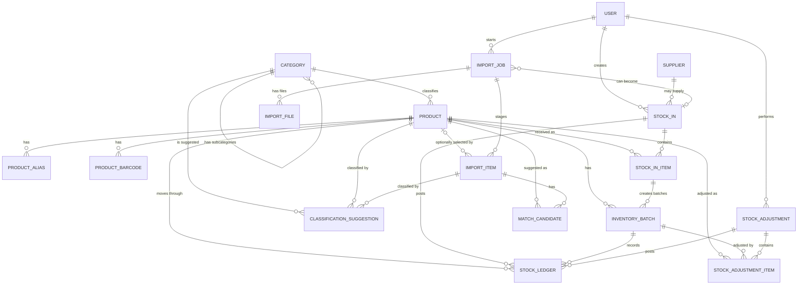
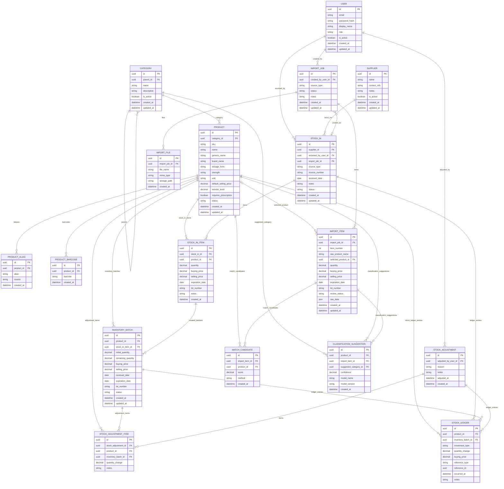

# Smart Inventory ERD

## Purpose

This document defines the Entity Relationship Diagram for the Smart Inventory Management system.

The ERD is the bridge between the business domain model and the future Prisma schema. It describes the entities, relationships, cardinality, and important fields that the database should represent.

This document does not define implementation code yet. It should guide the next phase, where these entities become Prisma models and database migrations.

## Scope

This ERD covers the inventory-first system only.

Included now:

| Included | Reason |
| --- | --- |
| User | Track who creates stock-in records, adjustments, and imports. |
| Category | Organize medicine and non-medicine products. |
| Product | Master item identity. |
| Product Alias | Support OCR, supplier names, search, and migration. |
| Product Barcode | Support barcode lookup and future POS scanning. |
| Supplier | Optional supplier context for stock-in records. |
| Stock In | One receiving event. |
| Stock In Item | One received product line. |
| Inventory Batch | Actual stock layer with quantity, cost, expiry, and lot. |
| Stock Ledger | Append-only history of inventory changes. |
| Stock Adjustment | Manual correction or non-sale stock change. |
| Stock Adjustment Item | One adjusted product or batch line. |
| Import Job | Staged OCR, Excel, CSV, or migration workflow. |
| Import File | Uploaded file connected to an import. |
| Import Item | One staged extracted/imported row for review. |
| Match Candidate | Suggested existing product match. |
| Classification Suggestion | Suggested product category. |

Deferred:

| Deferred | Reason |
| --- | --- |
| Sales | POS is not part of the first product. |
| Sale Items | Needed later for POS and COGS. |
| Payments | Needed later for POS. |
| Customers | Needed later only if the botika wants customer tracking. |
| Expenses | Accounting is not part of the first product. |
| Full permission matrix | Simple user roles are enough for the first version. |

## ERD Overview

## Detailed ERD

## Relationship Notes

### User Relationships

| Relationship | Cardinality | Required? | Notes |
| --- | --- | --- | --- |
| User to Stock In | One user, many stock-in records | Required | Every stock-in should track who encoded or received it. |
| User to Stock Adjustment | One user, many adjustments | Required | Every adjustment needs accountability. |
| User to Import Job | One user, many import jobs | Required | Every upload or import should have an owner. |

### Category Relationships

| Relationship | Cardinality | Required? | Notes |
| --- | --- | --- | --- |
| Category to Category | Optional parent, many children | Optional | Supports subcategories without forcing deep hierarchy. |
| Category to Product | One category, many products | Optional for product | Products can start uncategorized during import review. |
| Category to Classification Suggestion | One category, many suggestions | Required for suggestion | Every suggestion must point to the recommended category. |

### Product Relationships

| Relationship | Cardinality | Required? | Notes |
| --- | --- | --- | --- |
| Product to Product Alias | One product, many aliases | Optional | Useful for OCR, suppliers, and migration. |
| Product to Product Barcode | One product, many barcodes | Optional | Some products may not have barcodes. |
| Product to Stock In Item | One product, many received lines | Required before posting | Real stock cannot be created without a product. |
| Product to Inventory Batch | One product, many batches | Required for batch | Every batch must belong to a product. |
| Product to Stock Ledger | One product, many ledger entries | Required for ledger | Every stock movement affects a product. |

### Stock In Relationships

| Relationship | Cardinality | Required? | Notes |
| --- | --- | --- | --- |
| Supplier to Stock In | One supplier, many stock-in records | Optional | `supplier_id` must stay nullable because informal purchases may not have a supplier. |
| Import Job to Stock In | One import job, zero or one stock-in | Optional | Only approved imports become stock-in records. |
| Stock In to Stock In Item | One stock-in, many items | Required for posting | A posted stock-in should have at least one item. |
| Stock In Item to Inventory Batch | One item, one or more batches | Required after posting | In v1, the system will usually create one batch per stock-in item. Multiple batches can support split lots later. |

### Inventory Relationships

| Relationship | Cardinality | Required? | Notes |
| --- | --- | --- | --- |
| Inventory Batch to Stock Ledger | One batch, many ledger entries | Required for posted stock | Stock changes should be traceable. |
| Stock Adjustment to Stock Adjustment Item | One adjustment, many items | Required | Adjustments can cover multiple products. |
| Stock Adjustment Item to Inventory Batch | One batch, many adjustment items | Optional | Some corrections may happen at product level before batch is known. |
| Stock Adjustment to Stock Ledger | One adjustment, many ledger entries | Required after posting | Every adjustment must create ledger history. |

### Import Relationships

| Relationship | Cardinality | Required? | Notes |
| --- | --- | --- | --- |
| Import Job to Import File | One import job, many files | Optional | Manual imports may not need files; OCR usually does. |
| Import Job to Import Item | One import job, many items | Required after extraction | A useful import should produce reviewable items. |
| Import Item to Product | Zero or one selected product, many import items | Optional until approval | Import items may not be matched yet. The user may need to create or select a product. |
| Import Item to Match Candidate | One import item, many candidates | Optional | Matching may fail or be skipped. |
| Import Item to Classification Suggestion | One import item, many suggestions | Optional | Classification may be unavailable or unnecessary. |

## Entity Field Notes

### Product

Product fields should describe stable item identity.

| Field Group | Belongs Here? | Notes |
| --- | --- | --- |
| Name, SKU, brand, generic name | Yes | These describe the product itself. |
| Unit and prescription flag | Yes | These are product-level metadata. |
| Reorder level | Yes | This describes desired stock threshold for the product. |
| Default selling price | Yes, as default only | Actual received selling price belongs to Inventory Batch. |
| Buying price | No | Buying price changes per stock-in. |
| Expiration and lot number | No | These vary per batch. |

### Stock In

Stock In fields should describe the receiving event.

| Field Group | Belongs Here? | Notes |
| --- | --- | --- |
| Date received | Yes | It describes when the event happened. |
| Source type | Yes | Manual, Excel, CSV, OCR, or migration. |
| Supplier | Optional | Some purchases are informal. |
| Invoice number | Optional | Some suppliers do not provide formal invoices. |
| Product quantity and price | No | These belong to Stock In Item. |

### Inventory Batch

Inventory Batch fields should describe the actual stock layer.

| Field Group | Belongs Here? | Notes |
| --- | --- | --- |
| Initial quantity | Yes | Quantity created when stock is posted. |
| Remaining quantity | Yes | Current stock for this batch. |
| Buying price | Yes | Cost for this stock layer. |
| Selling price at receiving | Yes | Price intended for this batch at receiving time. |
| Expiration and lot number | Yes | Critical for pharmacy inventory. |
| Product name and category | No | Those are reached through Product. |

### Stock Ledger

Stock Ledger fields should explain stock movement history.

| Field Group | Belongs Here? | Notes |
| --- | --- | --- |
| Movement type | Yes | Stock in, adjustment add, adjustment remove, expired, damaged, correction. |
| Quantity change | Yes | Positive for increase, negative for decrease. |
| Product and batch references | Yes | Identify what changed. |
| Source reference | Yes | Points to Stock In, Stock Adjustment, or future POS sale. |
| Created or posted by user | Later | Add `created_by_user_id` or `posted_by_user_id` if a full audit trail is needed directly on ledger entries. |
| Current stock total | No | Current stock should be calculated from batches. |

### Import Job

Import Job fields should describe the review workflow.

| Field Group | Belongs Here? | Notes |
| --- | --- | --- |
| Source type and status | Yes | Tracks import progress. |
| Uploaded files | Yes, through Import File | OCR and Excel imports need file records. |
| Extracted rows | Yes, through Import Item | Rows are staged for review. |
| Final inventory | No | Final inventory is created through Stock In after approval. |

## Cardinality Summary

| Parent | Child | Cardinality |
| --- | --- | --- |
| User | Stock In | 1 to many |
| User | Stock Adjustment | 1 to many |
| User | Import Job | 1 to many |
| Category | Category | 0 or 1 parent to many children |
| Category | Product | 0 or 1 category to many products |
| Product | Product Alias | 1 to many |
| Product | Product Barcode | 1 to many |
| Supplier | Stock In | 0 or 1 supplier to many stock-in records |
| Stock In | Stock In Item | 1 to many |
| Product | Stock In Item | 1 to many |
| Stock In Item | Inventory Batch | 1 to many |
| Product | Inventory Batch | 1 to many |
| Product | Stock Ledger | 1 to many |
| Inventory Batch | Stock Ledger | 0 or 1 batch to many ledger entries |
| Stock Adjustment | Stock Adjustment Item | 1 to many |
| Product | Stock Adjustment Item | 1 to many |
| Inventory Batch | Stock Adjustment Item | 0 or 1 batch to many adjustment items |
| Import Job | Import File | 1 to many |
| Import Job | Import Item | 1 to many |
| Product | Import Item | 0 or 1 selected product per import item; one product can be selected by many import items |
| Import Item | Match Candidate | 1 to many |
| Product | Match Candidate | 1 to many |
| Import Item | Classification Suggestion | 0 or 1 import item to many suggestions |
| Product | Classification Suggestion | 0 or 1 product to many suggestions |
| Category | Classification Suggestion | 1 suggested category to many suggestions |

## Required Business Constraints

These constraints should be represented in the Prisma schema and enforced by application logic where the database alone is not enough.

| Constraint | Enforcement Notes |
| --- | --- |
| Product name should be searchable. | Add an index in the schema phase. |
| SKU should be unique when present. | Use a nullable unique field if supported cleanly. |
| Product barcode should be unique. | A barcode should identify only one product. |
| Product alias should be unique per product. | The same product should not store duplicate aliases. |
| Stock In Item must reference Product before posting. | Draft imports may be messy, but posted stock cannot be unknown. |
| Inventory Batch must reference Product. | Stock cannot exist without a product. |
| Stock In supplier must be nullable. | Supplier context is useful, but many real purchases are informal or incomplete. |
| Remaining quantity cannot be negative. | Enforce in service logic and database checks if practical. |
| Remaining quantity cannot exceed initial quantity. | Enforce in service logic and database checks if practical. |
| Stock Ledger entries should not be edited after creation. | Treat ledger as append-only in application logic. |
| Import Item must be approved before it becomes Stock In Item. | Enforce through import workflow. |
| Classification Suggestion cannot change Product category automatically. | Suggestions require user confirmation. |
| Match Candidate cannot select Product automatically. | User or explicit matching workflow must approve. |

## Naming Map For Future Prisma Schema

The business language should stay natural in docs and UI. The future Prisma schema can use code-friendly names while preserving the same meaning.

| Business Name | Suggested Prisma Model Name | Suggested Table Name |
| --- | --- | --- |
| User | User | users |
| Category | Category | categories |
| Product | Product | products |
| Product Alias | ProductAlias | product_aliases |
| Product Barcode | ProductBarcode | product_barcodes |
| Supplier | Supplier | suppliers |
| Stock In | StockIn | stock_ins |
| Stock In Item | StockInItem | stock_in_items |
| Inventory Batch | InventoryBatch | inventory_batches |
| Stock Ledger | StockLedgerEntry | stock_ledger_entries |
| Stock Adjustment | StockAdjustment | stock_adjustments |
| Stock Adjustment Item | StockAdjustmentItem | stock_adjustment_items |
| Import Job | ImportJob | import_jobs |
| Import File | ImportFile | import_files |
| Import Item | ImportItem | import_items |
| Match Candidate | MatchCandidate | match_candidates |
| Classification Suggestion | ClassificationSuggestion | classification_suggestions |

## Design Decisions

1. Stock In is the receiving event, not the current stock record.
2. Stock In Item captures what was received on one line.
3. Inventory Batch captures the actual stock layer created by receiving.
4. Stock Ledger records every quantity change and should be append-only.
5. Product does not store current stock, buying price, expiration, or lot number.
6. Supplier is optional, and `supplier_id` must remain nullable because community pharmacy purchases are often informal.
7. Import Job and Import Item are staging entities, not inventory entities.
8. OCR, Excel, CSV, and migration records must be approved before they create Stock In records.
9. Match Candidate and Classification Suggestion are advisory entities.
10. Stock Ledger can later include `created_by_user_id` or `posted_by_user_id` if direct ledger-level audit tracking is needed.
11. Future POS should consume Inventory Batch records and write Stock Ledger entries instead of bypassing inventory.

## Next Step

After this ERD is reviewed, the next step is to create the Prisma schema for the inventory-first database using the naming map and constraints in this document.
